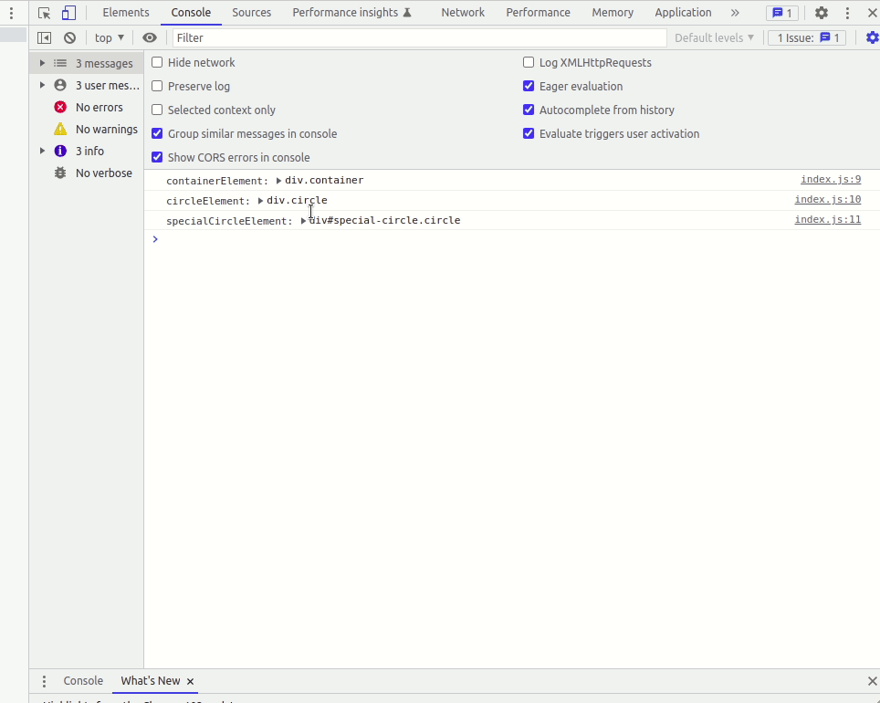
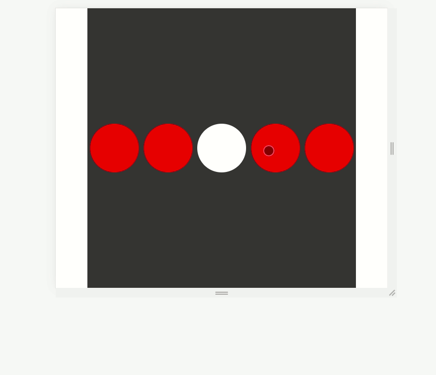
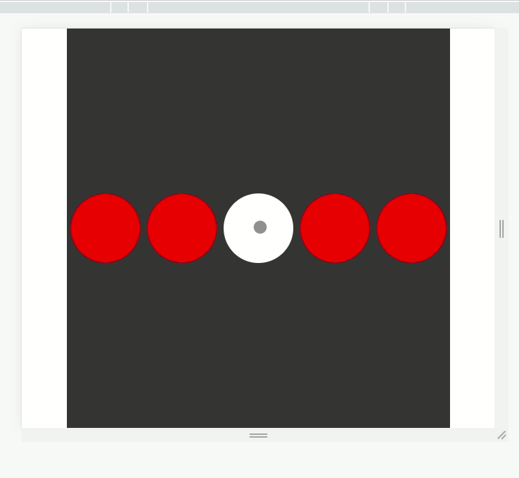
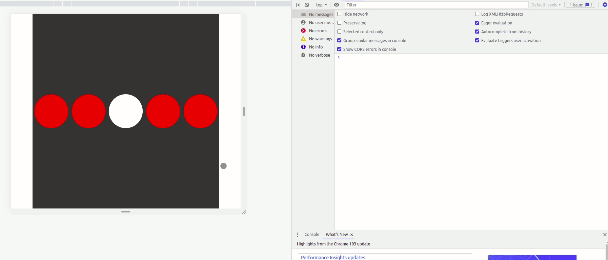

# SPA-DOM-EVENT-BUBBLING

Events machen es möglich, dynamische Seiten zu erstellen. Deshalb ist es wichtig zu wissen, wie man mit ihnen arbeitet und wie sie funktionieren. Ein Weg, um Events zu erzeugen, ist das Hinzufügen eines Event-Listeners zu einem Element in deinem DOM, in dem drei verschiedene Parameter übergeben werden müssen: Der erste ist die Art des Events, auf das du reagieren willst. Der zweite ist der Callback oder die Funktion, die du ausführen willst, wenn das Event eintritt. Und schließlich die Art in der das Event erfasst wird, die ein Boolescher Wert ist. Damit wird die Reihenfolge festgelegt, in der das Event im DOM erfasst wird. In den meisten Fällen wird dieser Wert false sein, was bedeutet, dass das Event von dem Target-Element aus, nach oben durch das DOM wandert. Die andere Option ist ein Capturing-Event, das genau umgekehrt funktioniert. Es geht vom Root des DOM zu dem Element, das du anvisierst.

[Bubbling and Capturing](https://javascript.info/bubbling-and-capturing)

## Was du tun wirst

Du wirst zwei verschiedene Events erstellen, um die Reihenfolge ihrer Ausführung zu verstehen, die Reihenfolge beim Capturing zu ändern und zu lernen, wie du ein Event stoppen kannst.

## Aufgaben

### Aufgabe 1 - HTML-Elemente finden

Verwende in der Datei ***index.js*** Javascript, um die Klassen `.circle` und `.container` und die id `#special-circle` zu finden

### Aufgabe 2 - HTML-Elemente ausgeben

Gib die gefundenen Elemente in der Konsole aus, um sicherzustellen, dass du alles richtig gemacht hast.

### Aufgabe 3 - Erstelle das erste Event

Erstelle einen Event-Listener, der ausgeführt wird, wenn du auf das HTML-Element klickst, das die `.container`-Klasse hat. Als Callback-Funktion musst du lediglich ausgeben: das `event`-Objekt, das `target` und die `currentTarget`-Eigenschaft des Event-Objekts in der Konsole.

### Aufgabe 4 - Event-Eigenschaften prüfen

Nimm dir ein paar Minuten Zeit, um alle Eigenschaften des `event`-Objekts anzusehen und den Unterschied zwischen `target` und `currentTarget` zu verstehen.

### Aufgabe 5 - Ausgewählte Elemente löschen

Verwende das Event-`target` und greife auf den `parentNode` des Target zu, dann entfernst du ein Kind, das das Target-Element ist. Im Grunde genommen wird also nur das Element gelöscht, auf das du klickst.

Diese Dokumentationen helfen dir https://www.javascripttutorial.net/javascript-dom/javascript-removechild/

### Aufgabe 6 - Löschbedingung erstellen

Ein Problem ist, dass, wenn du auf das Eltern-Element klickst, auch dieses Element gelöscht wird, denn das Event wird auf das Element mit der Klasse `.container` angewandt.
Um dieses Problem zu lösen, erstelle eine Bedingung, die es dir erlaubt, das ausgewählte Element nur dann zu löschen, wenn die Klasse des Target
`.circle` ist.

### Aufgabe 7 - Zweites Ereignis erstellen

Erstelle einen Event-Listener, der bei einem Klick auf das HTML-Element mit der `#special-circle`-id ausgeführt wird. Als Callback-Funktion musst du nur das Event-Objekt in der Konsole ausgeben und die `background-color` des Target auf `green` ändern.
Vergiss nicht, das erste Event zu stoppen, das durch einen Klick auf die `.container`-Klasse ausgelöst wird. Wenn du das nicht tust, kannst du die `#special-circle`-id nicht einfärben, weil sie durch das erste Event abgebrochen wird.

### Aufgabe 8 - Capture verwenden

Ändere die Reihenfolge der Ausführung von Events mit `capture`. Um die Sache zu vereinfachen, kommentiere den Teil des Codes für das erste Event, der die ausgewählten Elemente entfernt (Aufgabe 5), und den Teil des Codes für Aufgabe 7, der das erste Event stoppt.
Gib nun zwei verschiedene Strings (z.B. "event1" und "event2") in den beiden Events aus, um herauszufinden, welches Event zuerst ausgeführt wird.

